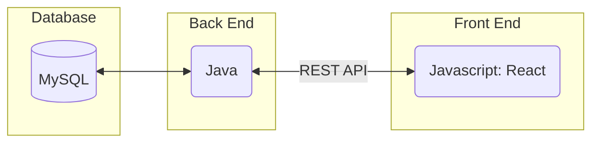
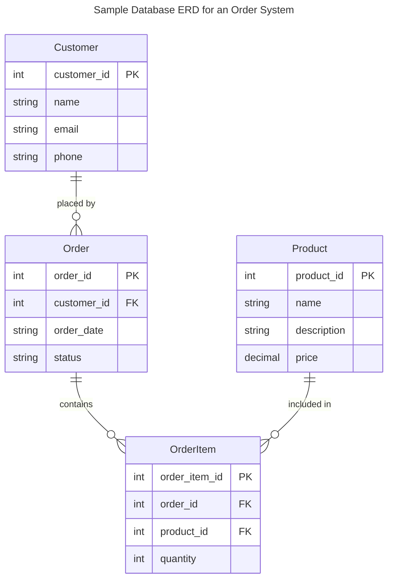
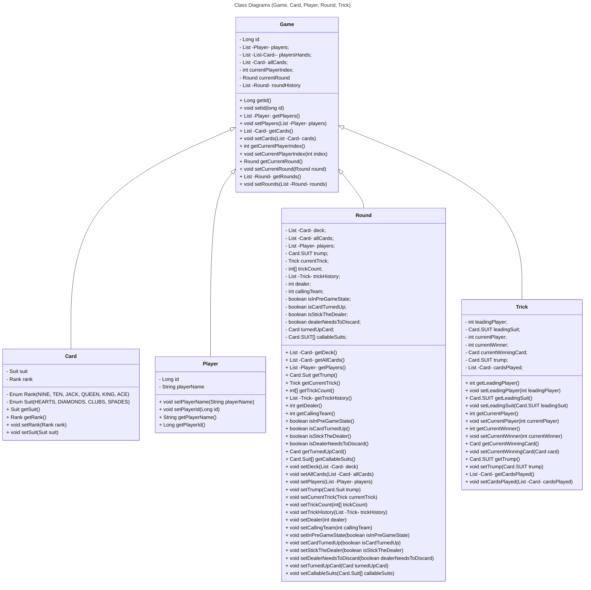
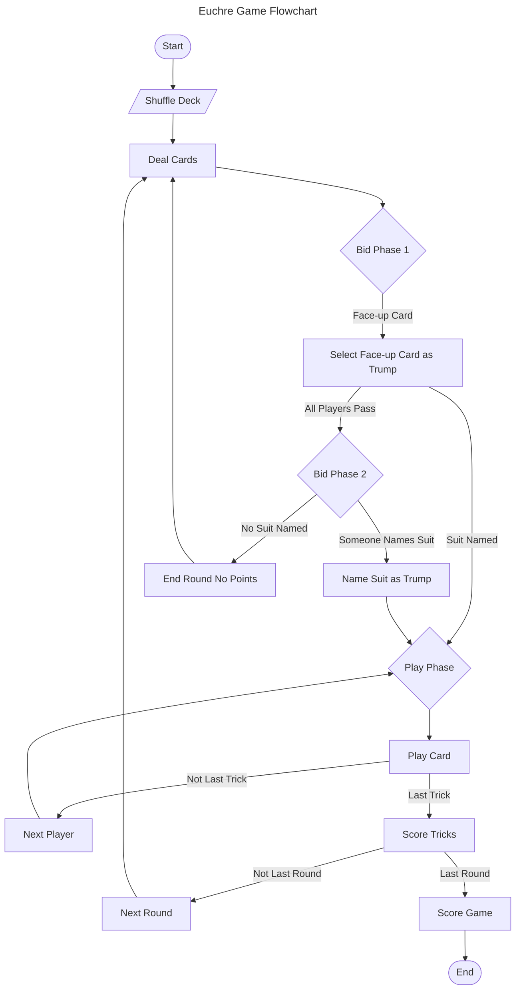
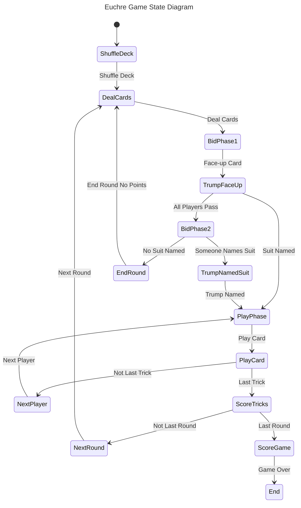
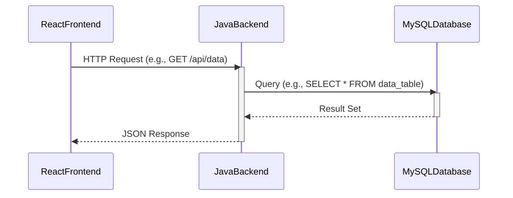

# Requirements and Specification Document

## Full House of Badgers

### Project Abstract

The card game engine is a piece of software designed to cater to the players, offering a wide variety of card games. Players are welcomed into a dynamic virtual arena where they can engage in thrilling matches against friends or challengers from around the globe. The users will interact with a React frontend that communicates with our java backend card engine. The engine will connect to a MySQL database pod to store user logins as well as user scores and leaderboards.

### Customer

The customer for this software in general is anyone who wants to play card games like Eucre socially.

Customer from 506 staff:

### Tech Stack

* Frontend: React
* Backend: Java
* Database: MySQL

<!--A brief description of the customer for this software, both in general (the population who might eventually use such a system) and specifically for this document (the customer(s) who informed this document). Every project will have a customer from the CS506 instructional staff. Requirements should not be derived simply from discussion among team members. Ideally your customer should not only talk to you about requirements but also be excited later in the semester to use the system.-->

### User Requirements

<!--This section lists the behavior that the users see. This information needs to be presented in a logical, organized fashion. It is most helpful if this section is organized in outline form: a bullet list of major topics (e.g., one for each kind of user, or each major piece of system functionality) each with some number of subtopics.-->

Here is a user requirements sample from [Crookshanks](https://learning-oreilly-com.ezproxy.library.wisc.edu/library/view/practical-software-development/9781484206201/9781484206218_Ch02.xhtml):

| ID   | Description                                                  | Priority | Status |
| ---- | ------------------------------------------------------------ | -------- | ------ |
| R11  | Users should not have to sign into the system; their current network login should be used for identification. | Med      | Done   |
| R12  | The user should pick a project first; the tasks available are a derivative of the project. | High     | Open   |
| R13  | A full-time employee should not be able to submit a time card with less than 40 hours per week recorded. | High     | Open   |
| R14  | A contractor can submit any number of hours up to 60 without special approval. | Med      | Open   |
| R15  | A team lead can see his/her team's time cards before they are submitted but cannot approve them until the user submits it. | High     | Open   |

<small><i>Excerpt from Crookshanks Table 2-2 showing example user requirements for a timekeeping system</i></small>

### Use Cases & User Stories

<!--Use cases and user stories that support the user requirements in the previous section. The use cases should be based off user stories. Every major scenario should be represented by a use case, and every use case should say something not already illustrated by the other use cases. Diagrams (such as sequence charts) are encouraged. Ask the customer what are the most important use cases to implement by the deadline. You can have a total ordering, or mark use cases with “must have,” “useful,” or “optional.” For each use case you may list one or more concrete acceptance tests (concrete scenarios that the customer will try to see if the use case is implemented).-->

Here is a sample user story from [Clean Agile](https://learning-oreilly-com.ezproxy.library.wisc.edu/library/view/clean-agile-back/9780135782002/ch03.xhtml#ch03lev1sec1) using a markdown block quote:

> As the driver of a car, in order to increase my velocity, I will press my foot harder on the accelerator pedal.

### User Interface Requirements

<!--Describes any customer user interface requirements including graphical user interface requirements as well as data exchange format requirements. This also should include necessary reporting and other forms of human readable input and output. This should focus on how the feature or product and user interact to create the desired workflow. Describing your intended interface as “easy” or “intuitive” will get you nowhere unless it is accompanied by details.-->

<!--NOTE: Please include illustrations or screenshots of what your user interface would look like -- even if they’re rough -- and interleave it with your description.-->

### Security Requirements

* Logins should be stored in the database with the passwords being hashed before being sent to the backend.
* Anyone accessing the backend should be authenticated before sending requests.

<!--Discuss what security requirements are necessary and why. Are there privacy or confidentiality issues? Is your system vulnerable to denial-of-service attacks?-->

### System Requirements

<!--List here all of the external entities, other than users, on which your system will depend. For example, if your system inter-operates with sendmail, or if you will depend on Apache for the web server, or if you must target both Unix and Windows, list those requirements here. List also memory requirements, performance/speed requirements, data capacity requirements, if applicable.-->

| You    |    can    |    also |
| ------ | :-------: | ------: |
| change |    how    | columns |
| are    | justified |         |

## Specification

<!--A detailed specification of the system. UML, or other diagrams, such as finite automata, or other appropriate specification formalisms, are encouraged over natural language.-->

<!--Include sections, for example, illustrating the database architecture (with, for example, an ERD).-->

<!--Included below are some sample diagrams, including some example tech stack diagrams.-->

### Technology Stack

#### Database

#### Class Diagram

#### Flowchart

#### Behavior

#### Sequence Diagram

### Standards & Conventions

[Coding Standards - HTML](./Coding%20Standards/Coding_Standard_Document_HTML_Frontend.txt)

[Coding Standards - Javascript](./Coding%20Standards/Coding_Standard_Document_Javascript_Frontend.txt)

[Coding Standards - CSS](./Coding%20Standards/Coding_Standard_Document_CSS_Frontend.txt)

[Coding Standards - Java](./Coding%20Standards/Coding_Standard_Document_Java_Backend.txt)

### Architecture Diagram

[Link to architecture diagram](https://drive.google.com/file/d/1oqKS26a37G5v7DhYKaEtYxw-6xVGIYjf/view?usp=sharing)
